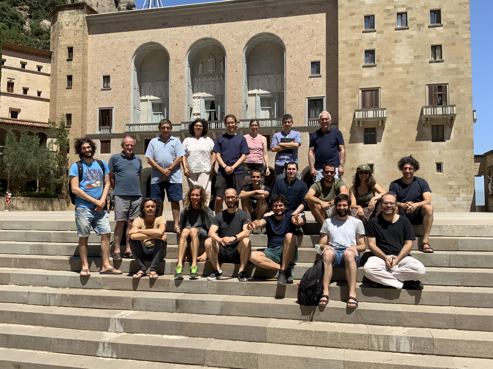

# [GAPCOMB: Geometric, Algebraic and Probabilistic Combinatorics](https://gapcomb.upc.edu/en)

## Research Interests

Convex polytopes, finite geometries, matroids, random graphs, free groups, finite model theory, planar maps, enumeration, extremal and additive combinatorics.

## Members

### Faculty
[Simeon Ball](https://mat-web.upc.edu/people/simeon.michael.ball/) (coordinator),
[Pep Burillo](https://mat-web.upc.edu/people/pep.burillo/main_en.php), [Anna de Mier](https://mat-web.upc.edu/people/anna.de.mier/), [Marc Noy](https://web.mat.upc.edu/marc.noy/), [Guillem Perarnau](https://web.mat.upc.edu/guillem.perarnau/), [Julian Pfeifle](https://mat.upc.edu/en/people/julian.pfeifle/), [Juanjo Rué](https://mat-web.upc.edu/people/juan.jose.rue/), [Oriol Serra](https://mat-web.upc.edu/people/oriol.serra/), [Enric Ventura](http://www-eupm.upc.es/~ventura/). 

### Postdoctoral Researchers

[Jordi Delgado](https://jdrmaths.wixsite.com/jdelgado) (Maria Zambrano Fellow), [Patrick Morris](https://sites.google.com/site/patrickmorriscombinatorics) (Benjamin Walter Fellow), [Tassio Naia dos Santos](https://www.ime.usp.br/~tassio/) (Maria de Maeztu Fellow), [Clément Requilé](https://requile.github.io/) (Beatriu de Pinós Researcher), Mallika Roy (Margarita Salas Fellow), [Lluis Vena](https://web.mat.upc.edu/lluis.vena/) (Beatriu de Pinós Researcher).

### PhD Students

Sofiya Burova, Jordi Castellvi, Miquel Ortega, Tabriz Popatia, Robin Simoens, Ricard Vilar. 

## Grants

PID2021-126851NB-I00 -- Geometric Methods in Group Theory. PI: E. Ventura. 2022-25.

PID2020-113082GB-I00 -- CONTREWA: Combinatorics: new trends and real-world applications. PI: S. Ball, G. Perarnau. 2021-24

RED2022-134947-T -- [Red de Matemática Discreta y Algorítmica](asdf). Coordinator: G. Perarnau. 2023-25

MSCA-RISE-2020-101007705 -- Research and Innovation Staff Exchange (Horizon 2020), [RandNET: Randomness and learning in networks](https://randnet.upc.edu/). PI: M. Noy. 2022-26.

## Links of interest

[LIMDA Seminar](https://gapcomb.upc.edu/en/seminar-en/forthcoming-seminars), weekly on Thursdays at 16:10, streamed online.  
[Reading Group](https://gapcomb.upc.edu/en/seminar-en/reading-group), on hot topics in Modern Combinatorics. 
[GAPCOMB Workshop](https://gapcomb.upc.edu/en/seminar-en/master-seminar-on-code-theory), annual group meeting. 
[Outreach](https://gapcomb.upc.edu/en/outreach) activities within the group.

## Selected Publications 

F. Joos, G. Perarnau, D. Rautenbach and B. Reed. How to determine if a random graph with a fixed degree sequence has a giant component. Probability Theory and Related Fields, 170(1):263-310 (2018). Proceedings version at FOCS 2016.

J. Martí-Farré, A. de Mier: Transformation and decomposition of clutters into matroids. Advances in Mathematics 312:286–314 (2017).

M. Noy, J. Rué, V. Ravelomanana: On the probability of planarity of a random graph near the critical point. Proceedings of the American Mathematical Society 143:925–936 (2015).

S. Ball, On sets of vectors of a finite vector space in which every subset of basis size is a basis, J. Eur. Math. Soc., 14:733-748 (2012).

O. Bogopolski, A. Martino, E. Ventura, Orbit decidability and the conjugacy problem for some extensions of groups, Transactions of the American Mathematical Society 362:2003-2036 (2010).

J. Burillo, S. Cleary, M. Stein and J. Taback, Combinatorial and metric properties of Thompson's group T. Trans. Amer. Math. Soc. 361:631-652 (2009).

O. Giménez, M. Noy, Asymptotic enumeration and limit laws for planar graphs, Journal AMS 22(2):309-329 (2009).

J. Pfeifle, G.M. Ziegler, Many triangulated 3-spheres, Mathematische Annalen 330(4):829-837 (2004).

