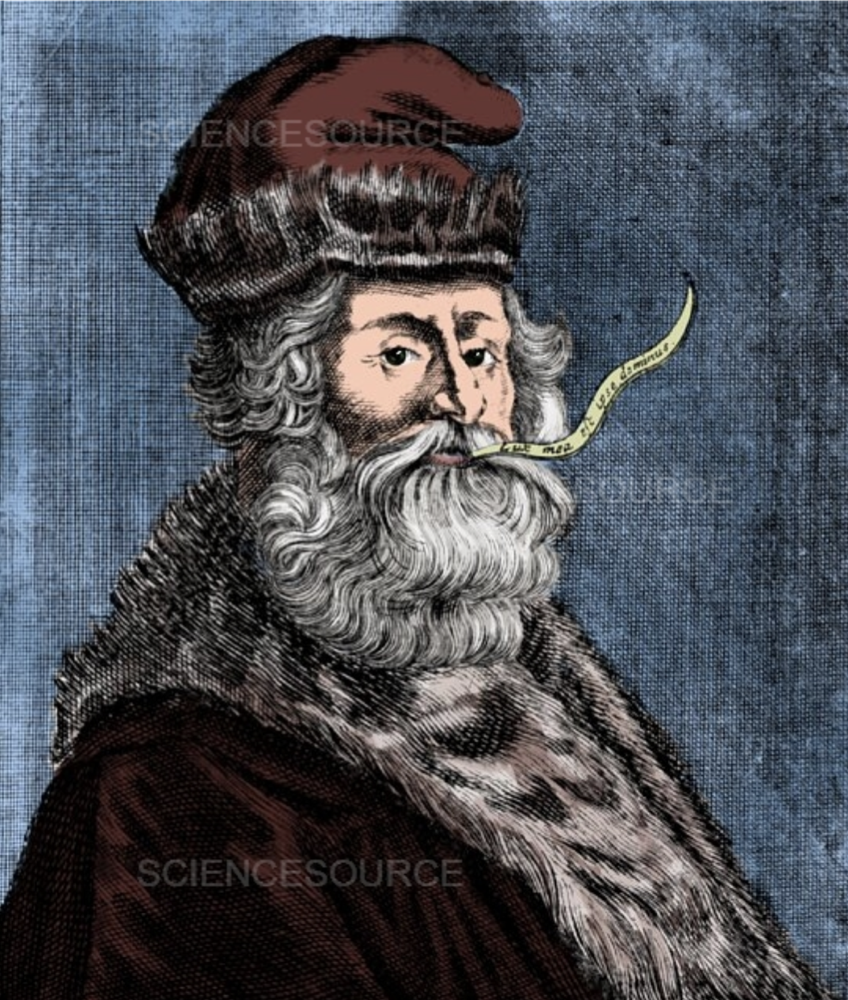
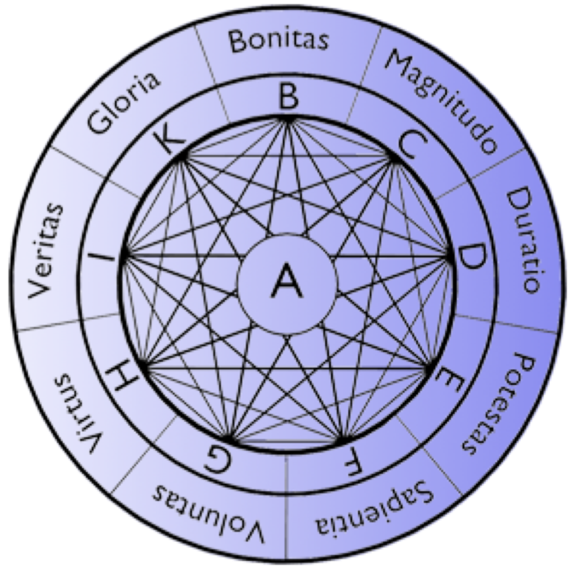

The **Ramon Llull Prize in Discrete Mathematics** is an academic award for outstanding doctoral thesis in Discrete Mathematics. It is awarded every two years by the Spanish Red de Matemática Discreta y Algorítmica (MDA). The prize winner is announced during the biennial edition of the Discrete Mathematics Days (DMD). Next edition of DMD will be held in July 3-5 2024 in Alcalá de Henares: 

https://dmd2024.web.uah.es/

The awardee will give a prize talk at the conference. Travel within Europe and accommodation expenses will be covered by the Red MDA. The composition of the international jury of the prize will be announced at the meeting.  

The topics of the prize cover all areas related to Discrete Mathematics, including but not limited to

- Coding Theory and Cryptography
- Combinatorial Number Theory
- Combinatorics
- Discrete and Computational Geometry
- Discrete Optimization
- Graph Theory
- Theoretical Computer Science

Eligibility of the candidates:
* Candidates must have defended their doctoral thesis from 1st January 2019 to 31st December 2023.
* Candidates must either have defended the doctoral thesis in a Spanish university or be of Spanish nationality.
* Candidates must have written the doctoral thesis in English.
* Candidates must present their candidacy by sending to the President of the Jury, Prof. Gabor Lugosi at gabor.lugosi@gmail.com the following documents:
    *  CV.
    * Copy of the doctoral thesis and publications arising from it.
    * Two recommendation letters to be sent directly by the recommenders to the President of the Jury.

The deadline for the first edition of the Prize is **31 of January, 2024**. 
 
 

## Who was Ramon Llull?

**Ramon Llull** (1232-1316) was a medieval philosopher born in Mallorca in 1232. Professor at the University of Paris, indefatigable traveler, he wrote more than 200 books on religion, phylosophy, science, moral and social order. He introduced a method named *Ars combinatoria*, a cosmogony integrating science, philosophy and religion in a common combinatorial framework, a complex devise synthesized in his Combinatorial Wheel, which intended to unify all knowledge and solve all problems, creating a vast network that connected men with God. Apart from his contribution to Combinatorics, Llull is considered to be the inventor of Condorcet voting method, 500 years before it was introduced by the Marquis of Condorcet. The Lullian Art had a notable influence on the development of Mathematics, in particular in the work of Leibniz on formal logic *Dissertio de Arte Combinatoria*.  

<table style="border:0px;">
<tr>
<td style="border:0px;background:white">  

</td>
<td style="border:0px;background:white">

</td>
</tr>
</table>

### References

- John Fauvel and Robin J. Wilson, "The Lull before the storm: Combinatorics and religion in the Renaissance", Bulletin of the Institute of Combinatorics and its Applications (ICA) , 11 (1994), pp. 49-58.

- Martin Gardner, Logic Machines and Diagrams, 2nd edition, University of Chicago Press, 1982

- G. Hägele and F. Pukelsheim (2001). "Llull's writings on electoral systems". Studia Lulliana. 41: 3–38. Archived from the original on 2006-02-07.
